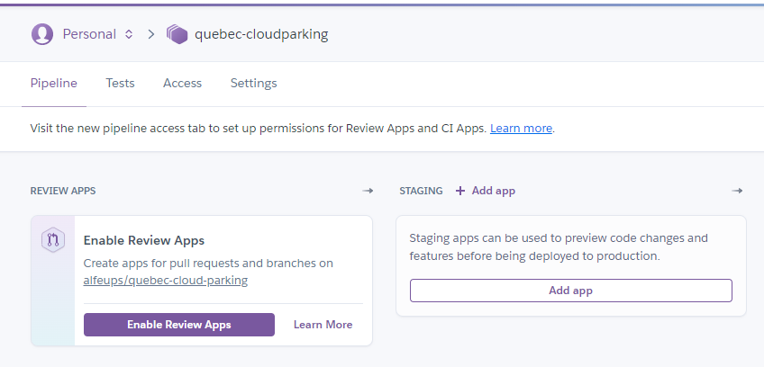

# Quebec-Cloud-Parking

<h2>API desenvolvida como parte do bootcamp Québec Java Digital na plataforma <a href="https://web.digitalinnovation.one/home">Digital Innovation One</a> no bootcamp </h2>

<h3>Foram abordados neste curso:</h3>
<li>Spring Boot</li>
<li>Docker para rodar MySQL</li>
<li>Spring Security</li>
<li>Spring data JPA</li>
<li>RESTful</li>
<li>Swagger para documentar</li>
<li>Maven</li>
<li>RestAssured for testing</li>
<li>Deployed with Heroku</li>